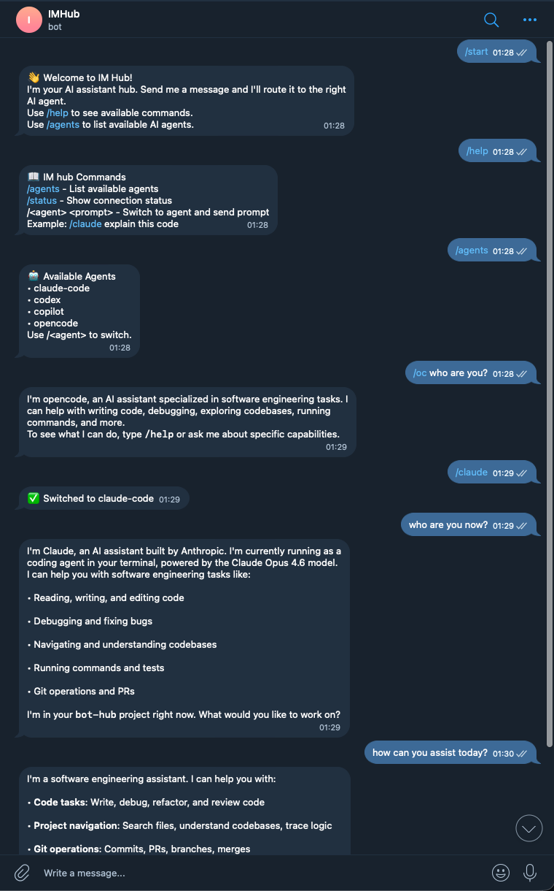
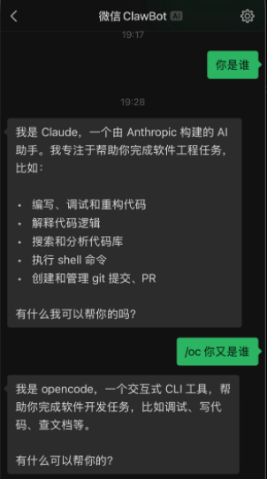

# im-hub

[中文文档](README.zh-CN.md)

**Universal messenger-to-agent bridge** — connect WeChat / Feishu / Telegram / **Discord** to Claude Code / Codex / Copilot / OpenCode, **or any custom agent via ACP**. Single Node.js process, no Docker, no Redis. Browser dashboard, persistent jobs, multi-tenant workspaces, and real human-in-the-loop tool approval over IM.

<p align="center">
  
</p>

<p align="center">
  <a href="https://www.npmjs.com/package/im-hub"></a>
  <a href="https://github.com/ceociocto/im-hub/actions/workflows/release.yml?query=branch%3Amain"></a>
  <a href="https://www.npmjs.com/package/im-hub"></a>
  <a href="LICENSE"></a>
</p>

<p align="center">
  <a href="https://discord.gg/R83CXYz5"></a>
  &nbsp;
  <a href="https://x.com/lijieisme"></a>
</p>

<p align="center">
  
  &nbsp;&nbsp;
  
</p>

<p align="center">
  <b>Telegram</b> &nbsp;&nbsp;&nbsp;&nbsp;&nbsp;&nbsp;&nbsp;&nbsp;&nbsp;&nbsp;&nbsp;&nbsp;&nbsp;&nbsp;&nbsp;&nbsp;&nbsp;&nbsp;&nbsp;&nbsp;&nbsp;&nbsp;&nbsp;&nbsp;&nbsp;&nbsp;&nbsp;&nbsp;&nbsp;&nbsp;&nbsp;&nbsp;&nbsp;&nbsp;&nbsp;&nbsp;&nbsp;&nbsp;&nbsp;&nbsp;&nbsp;&nbsp;&nbsp;&nbsp;&nbsp;&nbsp;&nbsp;&nbsp; <b>WeChat</b>
</p>

```
npm install -g im-hub
im-hub config wechat   # Scan QR to login
im-hub start           # Start the bridge + web UI on :3000
```

## What's new in v0.2.13 → v0.2.15

- **Discord adapter** (Gateway WebSocket via `discord.js`)
- **Human-in-the-loop tool approval** — Claude pauses on tool calls; you reply `y`/`n` in the same IM thread
- **Tasks dashboard** at `/tasks` with **Background** (Claude/opencode bgjobs) and **Subtasks** tabs
- **Multi-tenant workspaces** — per-workspace agent whitelist + rate limits
- **ACP server mode** — im-hub itself is an ACP-compatible agent (`POST /tasks` sync + SSE)
- **Persistent Job Board** + cron scheduler (SQLite, survives restarts)
- **Smart routing**: intent classifier (CJK + ASCII), circuit breaker, sticky sessions
- **Structured logging** (`pino`) with `traceId` end-to-end + audit log + Prometheus `/api/metrics`

See [CHANGELOG.md](CHANGELOG.md) for the full list.

## Web Chat & Tasks Dashboard

```
im-hub start           # Web UI at http://localhost:3000
                       #   /          chat
                       #   /tasks     jobs · schedules · bgjobs · subtasks
                       #   /settings  agents · messengers · ACP
```

- Real-time streaming via WebSocket
- Agent switching and chat history
- Bilingual UI (English / 中文) — auto-detects browser language
- `/tasks` surfaces persistent jobs, cron schedules, **`~/.claude/bgjobs`** + **`~/.config/opencode/bgjobs`** background tasks (override via `IMHUB_BGJOB_ROOTS`), and a flat list of every subtask in every session

## Features

- **Universal multiplexer** — one instance, multiple messengers, multiple agents
- **Custom agent support** — connect any agent via [ACP](https://agentcommunicationprotocol.dev) with `im-hub config agent`, or auto-discover via `/.well-known/acp`
- **Built-in IMs** — WeChat (iLink), Feishu (WebSocket long-poll), Telegram (grammy), **Discord** (discord.js)
- **Built-in CLI agents** — Claude Code, Codex, Copilot, OpenCode (all via shared `AgentBase` adapter)
- **Plugin architecture** — easy to add new messengers / agents
- **TypeScript native** — no Go, no Docker, no Redis
- **JSONL streaming** — real-time agent responses with multi-byte UTF-8 safety

## Installation

```bash
npm install -g im-hub
```

Requires **Node.js ≥ 18** (production deployments use ≥ 22 LTS — see [`docs/deployment.md`](docs/deployment.md)).

## Quick Start

```bash
# 1. Configure at least one messenger
im-hub config wechat        # QR-code login
im-hub config feishu        # App ID + Secret (no webhook needed)
im-hub config telegram      # @BotFather token
im-hub config discord       # Bot token; see docs/discord-setup.md

# 2. (Optional) Configure a CLI agent — most are auto-detected
im-hub config claude

# 3. (Optional) Connect a custom remote agent over ACP
im-hub config agent

# 4. Start the bridge
im-hub start
```

### Feishu (WebSocket Long Polling)

- ✅ No webhook configuration needed
- ✅ No public IP or domain required
- ✅ No ngrok or similar tools needed
- ✅ Works directly from localhost

### Discord

See [`docs/discord-setup.md`](docs/discord-setup.md) for the full bot-token / intents / OAuth flow.

### Connect Your Own Agent

im-hub speaks **ACP (Agent Communication Protocol)**, so you can plug in any agent that exposes a standard HTTP endpoint — your own business bots, internal tools, cloud services, anything.

```bash
im-hub config agent
# Interactive setup: name, endpoint URL, auth (none / Bearer / API key)
# Connection is validated automatically; /.well-known/acp is auto-discovered
```

After setup, chat with it the same way as built-in agents:

```
/myagent analyze the Q1 sales report
```

### Use im-hub *as* an agent

im-hub also exposes an ACP server — point any ACP-compliant client at `POST http://localhost:3000/tasks` (sync) or with `?mode=stream` (SSE). Auth is the same `Authorization: Bearer <web-token>`.

## CLI Commands

```
im-hub                 # Same as 'start'
im-hub start           # Start the bridge + web UI
im-hub config wechat   # Configure WeChat
im-hub config feishu   # Configure Feishu
im-hub config telegram # Configure Telegram
im-hub config discord  # Configure Discord
im-hub config claude   # Configure Claude Code
im-hub config agent    # Connect a custom ACP agent
im-hub agents          # List available agents
im-hub messengers      # List available messengers
im-hub help
```

## Chat Commands

Send these as messages to the bot. Responses are streamed back in the same thread.

| Command | What it does |
|---|---|
| (any text) | Route to the agent (sticky session, intent-classified) |
| `/<agent> <prompt>` | Switch agent and send (e.g. `/cc explain this`, `/oc`, `/cx`, `/co`) |
| `/help` | Show available commands |
| `/agents` | List available agents |
| `/status` | Show connection status |
| `/new` | Start a new conversation (clear context) |
| `/router status\|policy\|explain\|reset` | Inspect routing decisions, predict where a message would go |
| `/audit [n]` | Recent invocations from the audit log |
| `/job ...` | Inspect / cancel persistent jobs |
| `/schedule ...` | List / add / remove cron schedules |
| `/sessions` | List recent sessions for this thread |
| `/model [provider/model]` | View or change the session's model |
| `/models` | List models the current agent supports |
| `/think on\|off\|...` | Toggle "think harder" / extended-thinking modes |
| `/stats` | Per-agent invocation / latency / error stats |
| `y` / `n` / `批准` / `拒绝` | Approve or deny a pending Claude tool call (HITL) |

## Human-in-the-loop Tool Approval

When a Claude run launched from IM tries to use a tool, im-hub pauses it and posts an approval card to the same IM thread:

```
🔐 Tool approval request
Tool: Bash
Input: {"command":"rm -rf node_modules"}
Reply y to approve / n to deny  (auto-deny in 5 min)
req: a3f1c0d2
```

Reply `y`, `n`, `批准`, `拒绝`, etc. — the decision flows back through an MCP sidecar to Claude, which resumes (or aborts) accordingly. The same chain works for WeChat, Telegram, Feishu, and Discord with no per-platform changes. Disable with `IMHUB_APPROVAL_DISABLED=1`.

## Architecture

```
                       ┌─── External triggers ───┐
                       │ cron 30s tick            │
                       │ webhook → /api/notify    │
                       │ REST   → /api/invoke     │
                       │ ACP    → /tasks (sync/SSE)│
                       └────────────┬─────────────┘
┌─ IM ingress ──────────────────────┼───────────────────┐
│ WeChat iLink   (long-poll + heartbeat)               │
│ Telegram       (grammy)                              │
│ Feishu         (Lark SDK WebSocket)                  │
│ Discord        (discord.js Gateway)                  │
│ Web Chat       (browser WebSocket)                   │
└────────────────────────────────┬──────────────────────┘
                                 │ MessageContext
                                 ▼
            ┌── Pre-route gates ────────────────┐
            │ workspace.resolve(userId)          │
            │ rateLimiter.allow(userKey)         │
            │ traceId + pino child logger        │
            └────────────────┬───────────────────┘
                             ▼
            ┌── parseMessage + Intent ──────────┐
            │ /<cmd>     → builtin sub-command  │
            │ /<agent>   → explicit switch      │
            │ default    → classifyIntent       │
            │   ├ topic regex (CJK + ASCII)     │
            │   ├ keyword profile               │
            │   ├ sticky session bias           │
            │   └ LLM judge (opt-in fallback)   │
            └────────────────┬───────────────────┘
                             ▼
            ┌── Agent invocation ───────────────┐
            │ workspace whitelist + circuit     │
            │ breaker + isAvailable cache       │
            │ AgentBase.sendPrompt → spawnStream │
            │  (LineBuffer · true streaming ·   │
            │   abort/timeout · UTF-8 safe)     │
            └────────────────┬───────────────────┘
              ┌──────┬───────┼────────┬─────────┐
              ▼      ▼       ▼        ▼         ▼
          opencode claude  codex   copilot   ACP remote
                     │
                     ▼ (if a tool needs approval)
              MCP sidecar ─ unix socket ─ approvalBus
                                            └─ approvalRouter → IM thread

┌─ Cross-cutting ───────────────────────────────────────┐
│ audit-log    (SQLite, 30-day retention)               │
│ job-board    (SQLite, persistent + AbortController)   │
│ scheduler    (30s tick → cron → enqueue jobs)         │
│ workspaces   (per-tenant agent whitelist + limits)    │
│ metrics      (Prometheus text via /api/metrics)       │
│ session      (~/.im-hub/sessions/, append-only JSONL) │
│ pino         (traceId end-to-end, JSON in production) │
└───────────────────────────────────────────────────────┘
```

Single-process, single-instance: SQLite (`audit.db` / `jobs.db` / `schedules.db`) plus a session file tree is the entire persistence layer. No Redis, no MQ.

For the full deep-dive see [`docs/architecture/current.md`](docs/architecture/current.md).

## Project Structure

```
im-hub/
├── src/
│   ├── core/
│   │   ├── types.ts              # Plugin interfaces
│   │   ├── registry.ts           # Plugin registration
│   │   ├── router.ts             # Message routing
│   │   ├── session.ts            # Session manager (append-only JSONL)
│   │   ├── workspace.ts          # Multi-tenant workspaces
│   │   ├── intent.ts             # Intent classifier
│   │   ├── intent-llm.ts         # LLM judge fallback (LRU cached)
│   │   ├── circuit-breaker.ts    # Per-agent breaker
│   │   ├── rate-limiter.ts       # Token-bucket
│   │   ├── job-board.ts          # Persistent jobs + cancel
│   │   ├── schedule.ts           # Cron tick → job enqueue
│   │   ├── audit-log.ts          # SQLite audit
│   │   ├── metrics.ts            # Prometheus quantiles
│   │   ├── acp-server.ts         # /tasks ACP server
│   │   ├── approval-bus.ts       # Tool-approval pub/sub
│   │   ├── approval-router.ts    # Approval ↔ IM bridge
│   │   ├── bgjob-reader.ts       # ~/.claude + ~/.config/opencode bgjobs
│   │   ├── agent-base.ts         # Shared spawn-stream for CLI agents
│   │   ├── config-schema.ts      # Zod schema
│   │   ├── logger.ts             # pino + traceId
│   │   ├── sqlite-helper.ts      # Shared prepare/PRAGMA cache
│   │   └── commands/             # /audit /router /job /schedule /model …
│   ├── plugins/
│   │   ├── messengers/
│   │   │   ├── wechat/           # iLink long-poll
│   │   │   ├── feishu/           # Lark SDK WebSocket
│   │   │   ├── telegram/         # grammy
│   │   │   └── discord/          # discord.js
│   │   └── agents/
│   │       ├── claude-code/      # + MCP approval sidecar
│   │       ├── codex/
│   │       ├── copilot/
│   │       ├── opencode/
│   │       └── acp/              # ACP client + /.well-known discovery
│   ├── index.ts
│   ├── cli.ts
│   └── web/
│       ├── server.ts             # HTTP + WS + REST + ACP server
│       └── public/
│           ├── index.html         # Chat UI
│           ├── tasks.html         # Tasks dashboard
│           └── settings.html      # Settings UI
├── docs/
│   ├── architecture/{current,target}.md
│   ├── adr/{0001,0002,0003}-*.md
│   ├── deployment.md
│   ├── discord-setup.md
│   └── upgrade-plan.md
├── package.json
├── tsconfig.json
└── README.md
```

## Configuration

Config file: `~/.im-hub/config.json`

```json
{
  "messengers": ["wechat", "discord"],
  "agents": ["claude-code", "opencode"],
  "defaultAgent": "claude-code",
  "discord": {
    "botToken": "***",
    "allowedGuilds": [],
    "allowedChannels": []
  },
  "acpAgents": [
    {
      "name": "my-agent",
      "aliases": ["ma"],
      "endpoint": "https://api.example.com",
      "auth": { "type": "bearer", "token": "***" },
      "enabled": true
    }
  ],
  "workspaces": [
    {
      "id": "team-data",
      "name": "Data team",
      "agents": ["opencode", "my-agent"],
      "members": ["user-123"],
      "rateLimit": { "rate": 30, "intervalSec": 60, "burst": 60 }
    }
  ]
}
```

The schema is enforced by `zod` at startup and on every PUT `/api/config` — bad configs reject loudly instead of silently breaking the bridge.

## Requirements

- **Node.js 18+** (≥ 22 LTS recommended for production)
- **At least one Agent CLI** (or an ACP remote endpoint):
  - `npm i -g @anthropic-ai/claude-code`
  - `npm i -g @openai/codex`
  - `npm i -g @github/copilot`
  - `npm i -g opencode-ai`

## Development

```bash
git clone https://github.com/benking007/imhub.git
cd im-hub
npm install
npm run build      # tsc + copy public/
npm run dev        # tsc --watch
npm test           # bun test
npm run typecheck  # tsc --noEmit (src + tests)
npm start
```

## Roadmap

### v0.1.x (MVP)
- [x] WeChat adapter with QR login
- [x] Claude Code, Codex, Copilot, OpenCode agents
- [x] Basic command routing

### v0.2.0 — Multi-IM
- [x] Feishu adapter
- [x] Telegram adapter
- [x] Session persistence with conversation history
- [x] ACP custom agent support

### v0.2.x — Web & UI
- [x] Web Chat UI with streaming
- [x] Settings page
- [x] Bilingual UI (EN / 中文)

### v0.2.13 — Foundations
- [x] Structured logging (pino) + traceId
- [x] Zod config schema validation
- [x] AgentBase abstraction + healthCheck cache
- [x] Audit log (SQLite) + `/audit`
- [x] Intent classifier + circuit breaker + rate limiter
- [x] ACP server mode (`POST /tasks` sync + SSE)
- [x] `/.well-known/acp` discovery
- [x] Multi-tenant workspaces + agent whitelist
- [x] Persistent Job Board + cron scheduler
- [x] Web `/tasks` panel + REST jobs API
- [x] Prometheus metrics

### v0.2.14 — Tool approval
- [x] Human-in-the-loop tool approval over IM
- [x] MCP approval sidecar (claude-code adapter)

### v0.2.15 — Discord & Dashboard
- [x] Discord messenger adapter
- [x] Tasks dashboard surfaces Claude / opencode bgjobs
- [x] Flattened subtasks tab

### v0.3.0
- [ ] DingTalk adapter
- [ ] Slack adapter
- [ ] Approval cards (Feishu/Discord buttons) instead of plain text

## Community <a name="wechat-group"></a>

Questions? Feel free to reach out on [X](https://x.com/lijieisme) or join the Discord.

<p align="center">
  <a href="https://discord.gg/R83CXYz5">
    
  </a>
  &nbsp;
  <a href="https://x.com/lijieisme">
    
  </a>
</p>

<p align="center">
  <br>
  <sub><i>Original author's contact</i></sub>
</p>

## License

MIT
